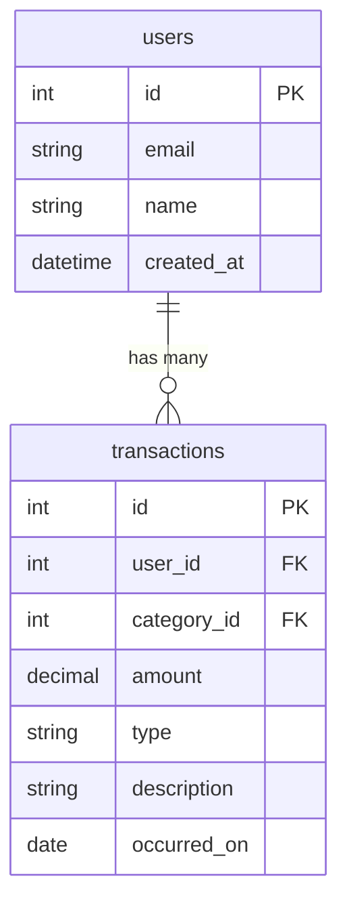

# SPEC - 仕様書・設計図

このディレクトリはプロジェクトの仕様書と設計図を管理する。

## 構成

```
SPEC/
├── api/              # API仕様書
│   ├── auth.md       # 認証API
│   ├── transactions.md  # 収支API
│   ├── categories.md    # カテゴリAPI
│   └── reports.md    # レポートAPI
├── diagrams/         # 設計図
│   ├── er.md         # ER図
│   ├── dfd.md        # DFD（データフロー図）
│   ├── sequence.md   # シーケンス図
│   ├── class.md      # クラス図
│   ├── state.md      # 状態遷移図
│   └── usecase.md    # ユースケース図
└── README.md         # このファイル
```

## 図解ツール

Mermaid を使用すること。GitHub / GitLab / VS Code で自動レンダリングされる。

### Mermaid の例


