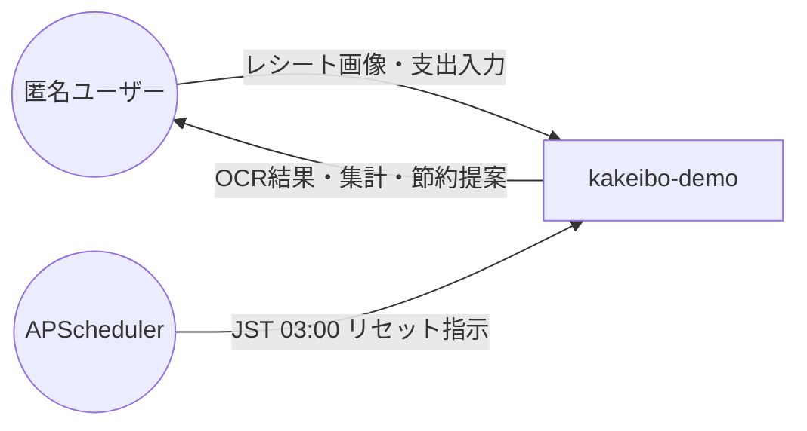
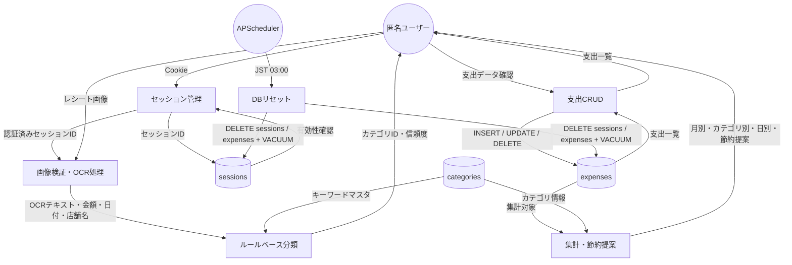

# DFD - データフロー図 (Data Flow Diagram)

最終更新: 2026-05-31

## レベル0（コンテキスト図）

```mermaid
graph LR
    User((匿名ユーザー))
    Scheduler((APScheduler))
    System[kakeibo-demo]

    User -->|レシート画像・支出入力| System
    System -->|OCR結果・集計・節約提案| User
    Scheduler -->|JST 03:00 リセット指示| System
```

## レベル1（主要プロセス）

```mermaid
graph TD
    User((匿名ユーザー))
    Scheduler((APScheduler))

    P1[セッション管理]
    P2[画像検証・OCR処理]
    P3[ルールベース分類]
    P4[支出CRUD]
    P5[集計・節約提案]
    P6[DBリセット]

    DS1[(sessions)]
    DS2[(expenses)]
    DS3[(categories)]

    User -->|Cookie| P1
    P1 -->|セッションID| DS1
    DS1 -->|有効性確認| P1
    P1 -->|認証済みセッションID| P2

    User -->|レシート画像| P2
    P2 -->|OCRテキスト・金額・日付・店舗名| P3
    DS3 -->|キーワードマスタ| P3
    P3 -->|カテゴリID・信頼度| User

    User -->|支出データ確認| P4
    P4 -->|INSERT / UPDATE / DELETE| DS2
    DS2 -->|支出一覧| P4
    P4 -->|支出一覧| User

    DS2 -->|集計対象| P5
    DS3 -->|カテゴリ情報| P5
    P5 -->|月別・カテゴリ別・日別・節約提案| User

    Scheduler -->|JST 03:00| P6
    P6 -->|DELETE sessions / expenses + VACUUM| DS1
    P6 -->|DELETE sessions / expenses + VACUUM| DS2
```
