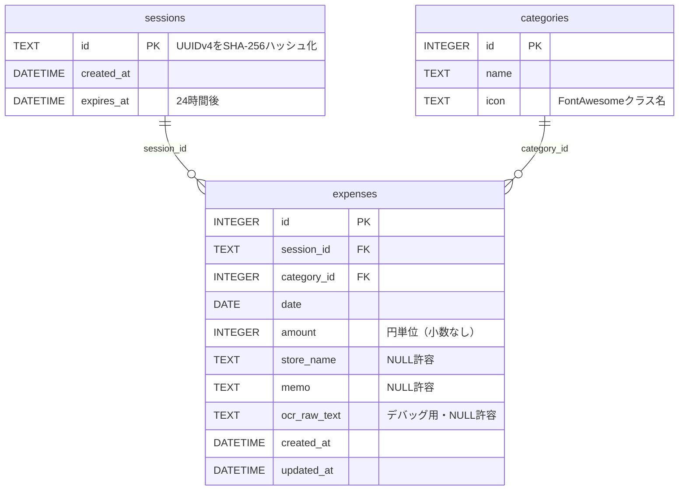

# ER図 (Entity Relationship Diagram)

最終更新: 2026-05-31

## カテゴリマスタ（固定8件・リセット対象外）

| id | name | icon |
|---|---|---|
| 1 | 食料品 | `fa-solid fa-basket-shopping` |
| 2 | 外食 | `fa-solid fa-utensils` |
| 3 | 交通 | `fa-solid fa-train` |
| 4 | 医療・健康 | `fa-solid fa-heart-pulse` |
| 5 | 衣類・美容 | `fa-solid fa-shirt` |
| 6 | 日用品 | `fa-solid fa-soap` |
| 7 | 娯楽 | `fa-solid fa-gamepad` |
| 8 | その他 | `fa-solid fa-circle-dot` |

## リセット挙動

毎日 JST 03:00 に `sessions` と `expenses` の全レコードを削除 + VACUUM。
`categories` はリセット対象外（固定マスタ）。
