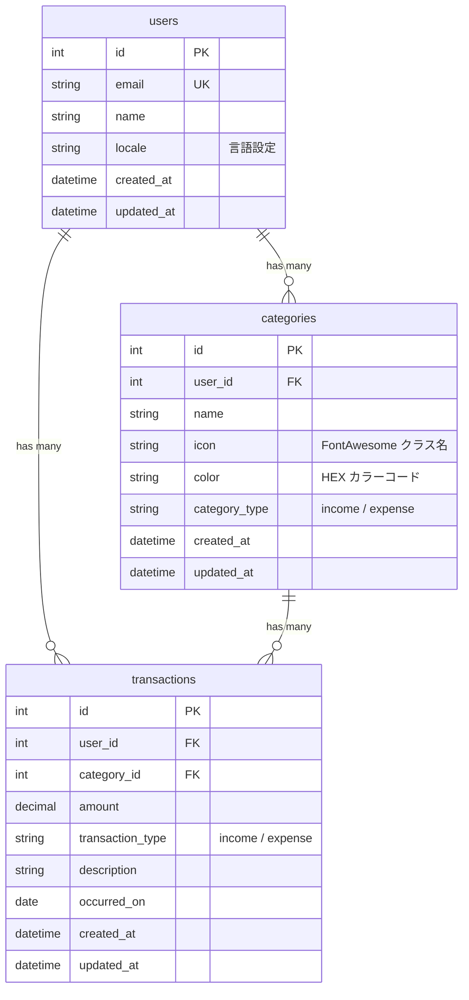

# ER図 (Entity Relationship Diagram)

最終更新: 2026-05-31

```mermaid
erDiagram
    users {
        int id PK
        string email UK
        string name
        string locale "言語設定"
        datetime created_at
        datetime updated_at
    }

    categories {
        int id PK
        int user_id FK
        string name
        string icon "FontAwesome クラス名"
        string color "HEX カラーコード"
        string category_type "income / expense"
        datetime created_at
        datetime updated_at
    }

    transactions {
        int id PK
        int user_id FK
        int category_id FK
        decimal amount
        string transaction_type "income / expense"
        string description
        date occurred_on
        datetime created_at
        datetime updated_at
    }

    users ||--o{ categories : "has many"
    users ||--o{ transactions : "has many"
    categories ||--o{ transactions : "has many"
```
