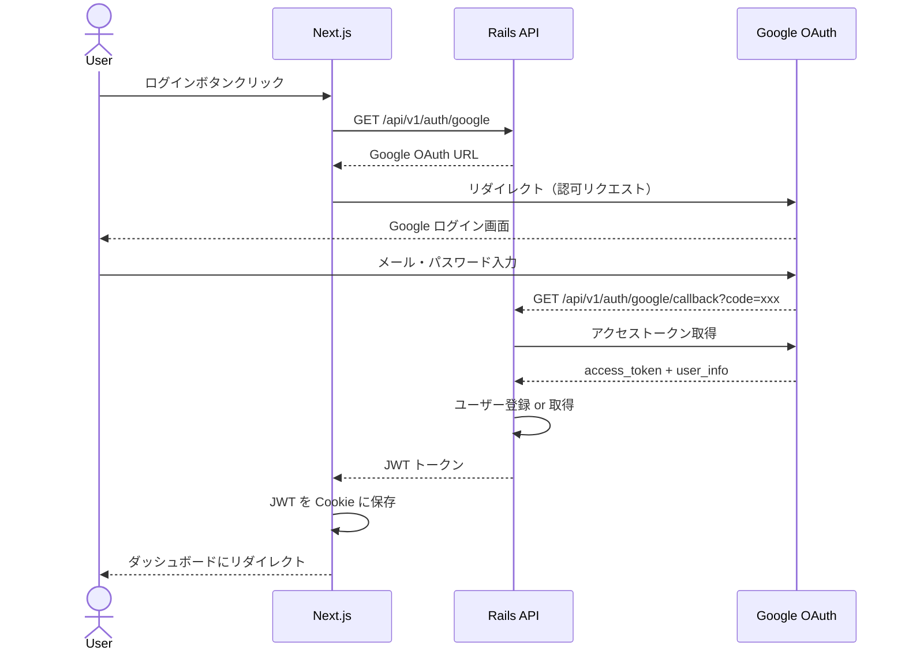
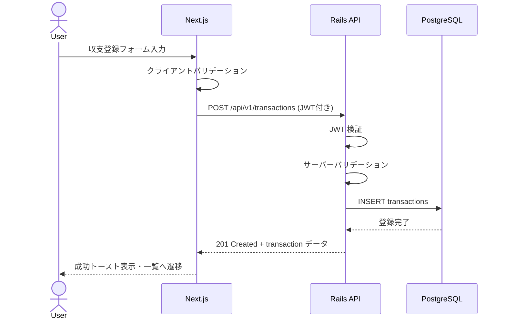

# シーケンス図 (Sequence Diagram)

最終更新: 2026-05-31

## Google OAuth ログインフロー

```mermaid
sequenceDiagram
    actor User
    participant Front as Next.js
    participant API as Rails API
    participant Google as Google OAuth

    User->>Front: ログインボタンクリック
    Front->>API: GET /api/v1/auth/google
    API-->>Front: Google OAuth URL
    Front->>Google: リダイレクト（認可リクエスト）
    Google-->>User: Google ログイン画面
    User->>Google: メール・パスワード入力
    Google-->>API: GET /api/v1/auth/google/callback?code=xxx
    API->>Google: アクセストークン取得
    Google-->>API: access_token + user_info
    API->>API: ユーザー登録 or 取得
    API-->>Front: JWT トークン
    Front->>Front: JWT を Cookie に保存
    Front-->>User: ダッシュボードにリダイレクト
```

## 収支登録フロー

```mermaid
sequenceDiagram
    actor User
    participant Front as Next.js
    participant API as Rails API
    participant DB as PostgreSQL

    User->>Front: 収支登録フォーム入力
    Front->>Front: クライアントバリデーション
    Front->>API: POST /api/v1/transactions (JWT付き)
    API->>API: JWT 検証
    API->>API: サーバーバリデーション
    API->>DB: INSERT transactions
    DB-->>API: 登録完了
    API-->>Front: 201 Created + transaction データ
    Front-->>User: 成功トースト表示・一覧へ遷移
```
