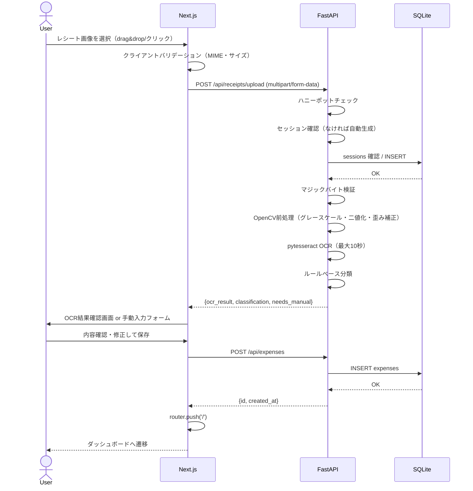
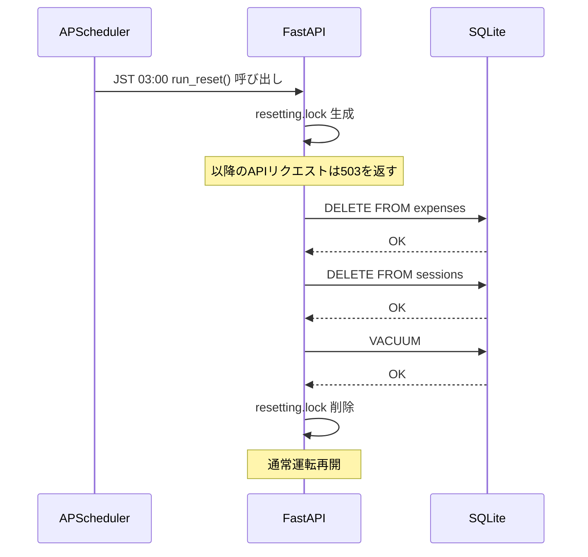

# シーケンス図 (Sequence Diagram)

最終更新: 2026-05-31

## レシートアップロード〜保存フロー



## DBリセットフロー



## セッション自動生成フロー

```mermaid
sequenceDiagram
    actor User
    participant Front as Next.js
    participant API as FastAPI
    participant DB as SQLite

    User->>Front: 初回アクセス
    Front->>API: GET /api/dashboard（Cookieなし）
    API->>API: Cookie なし → 新セッション生成
    API->>API: UUID v4 → SHA-256ハッシュ
    API->>DB: INSERT sessions
    DB-->>API: OK
    API-->>Front: Set-Cookie: session_id=<raw_uuid>; HttpOnly
    Front-->>User: ダッシュボード表示
```
