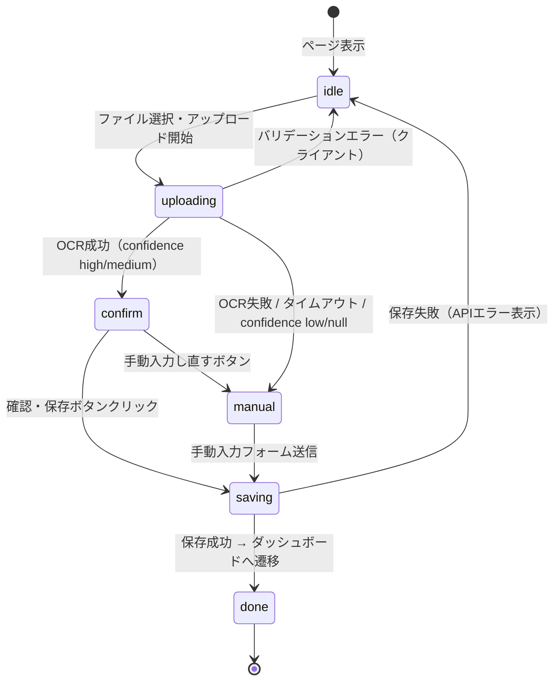
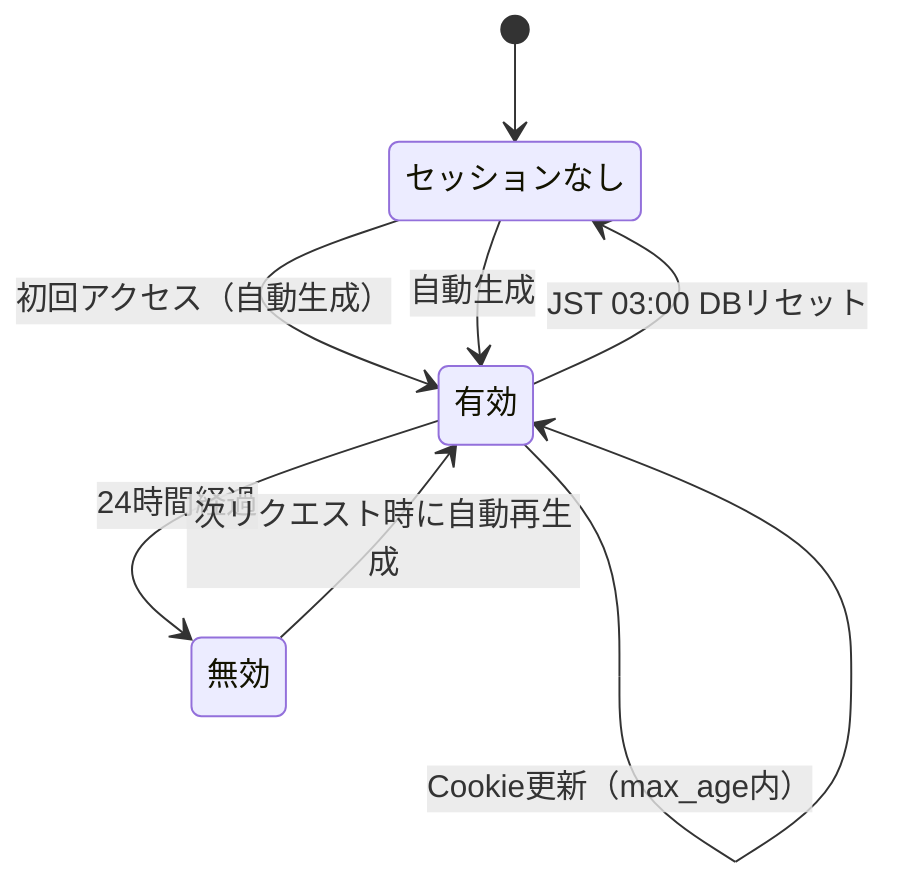
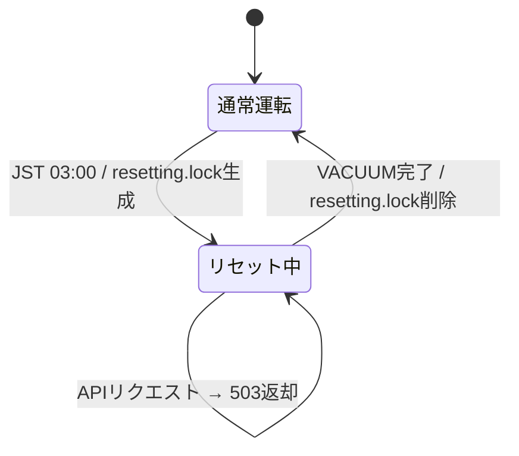

# 状態遷移図 (State Diagram)

最終更新: 2026-05-31

## アップロードページ状態遷移

```mermaid
stateDiagram-v2
    [*] --> idle : ページ表示

    idle --> uploading : ファイル選択・アップロード開始
    uploading --> idle : バリデーションエラー（クライアント）
    uploading --> confirm : OCR成功（confidence high/medium）
    uploading --> manual : OCR失敗 / タイムアウト / confidence low/null

    confirm --> saving : 確認・保存ボタンクリック
    confirm --> manual : 手動入力し直すボタン
    manual --> saving : 手動入力フォーム送信

    saving --> done : 保存成功 → ダッシュボードへ遷移
    saving --> idle : 保存失敗（APIエラー表示）

    done --> [*]
```

## セッション状態遷移

```mermaid
stateDiagram-v2
    [*] --> セッションなし

    セッションなし --> 有効 : 初回アクセス（自動生成）
    有効 --> 有効 : 通常操作
    有効 --> 有効 : Cookie更新（max_age内）
    有効 --> 無効 : 24時間経過
    有効 --> セッションなし : JST 03:00 DBリセット
    無効 --> 有効 : 次リクエスト時に自動再生成

    セッションなし --> 有効 : 自動生成
```

## DBリセット状態遷移

```mermaid
stateDiagram-v2
    [*] --> 通常運転

    通常運転 --> リセット中 : JST 03:00 / resetting.lock生成
    リセット中 --> リセット中 : APIリクエスト → 503返却
    リセット中 --> 通常運転 : VACUUM完了 / resetting.lock削除
```
