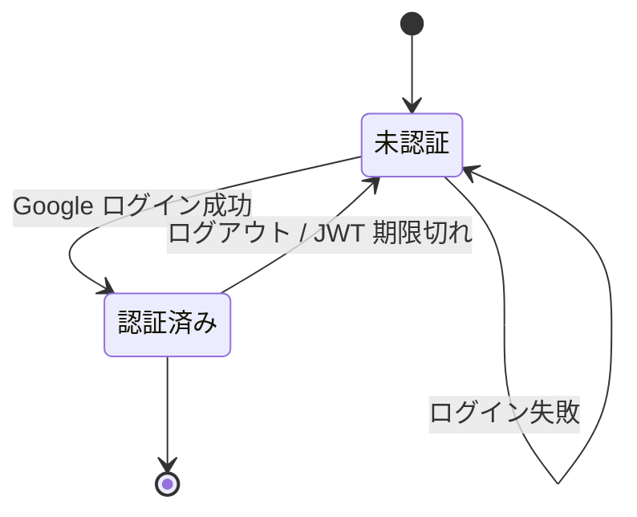
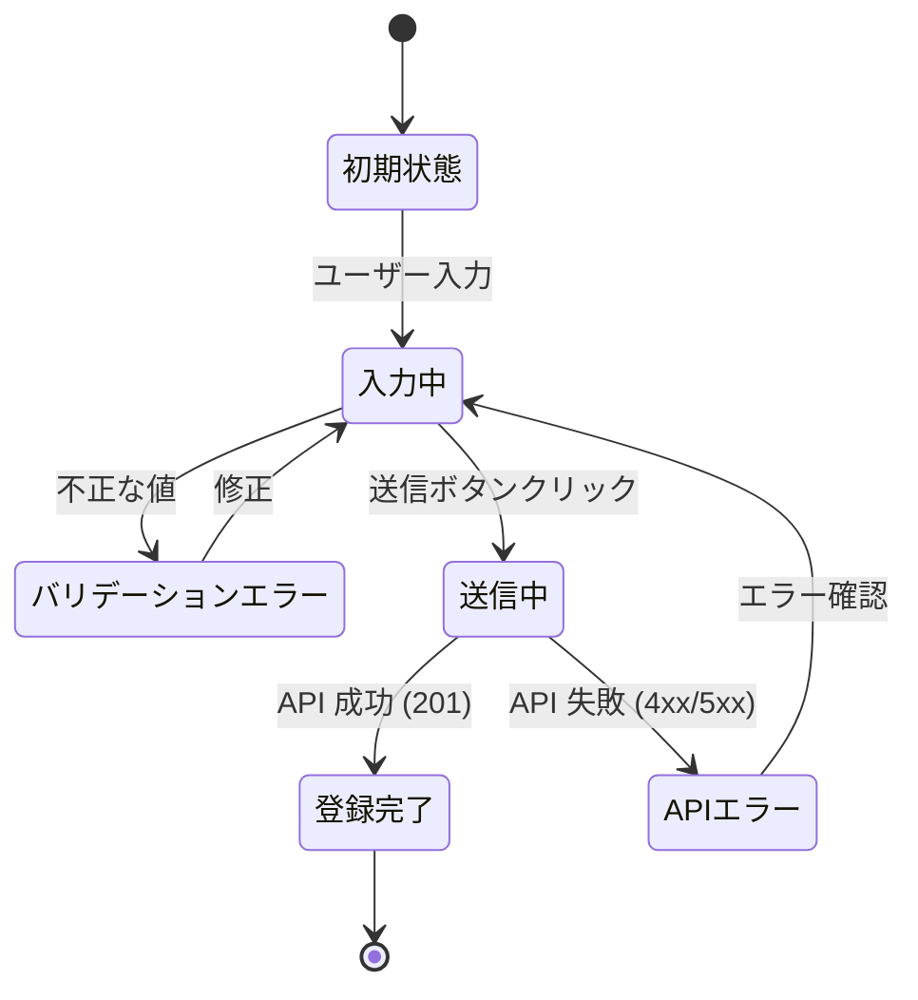

# 状態遷移図 (State Diagram)

最終更新: 2026-05-31

## 認証状態

```mermaid
stateDiagram-v2
    [*] --> 未認証
    未認証 --> 認証済み : Google ログイン成功
    認証済み --> 未認証 : ログアウト / JWT 期限切れ
    未認証 --> 未認証 : ログイン失敗
    認証済み --> [*]
```

## 収支登録フォーム状態

```mermaid
stateDiagram-v2
    [*] --> 初期状態
    初期状態 --> 入力中 : ユーザー入力
    入力中 --> バリデーションエラー : 不正な値
    バリデーションエラー --> 入力中 : 修正
    入力中 --> 送信中 : 送信ボタンクリック
    送信中 --> 登録完了 : API 成功 (201)
    送信中 --> APIエラー : API 失敗 (4xx/5xx)
    APIエラー --> 入力中 : エラー確認
    登録完了 --> [*]
```
