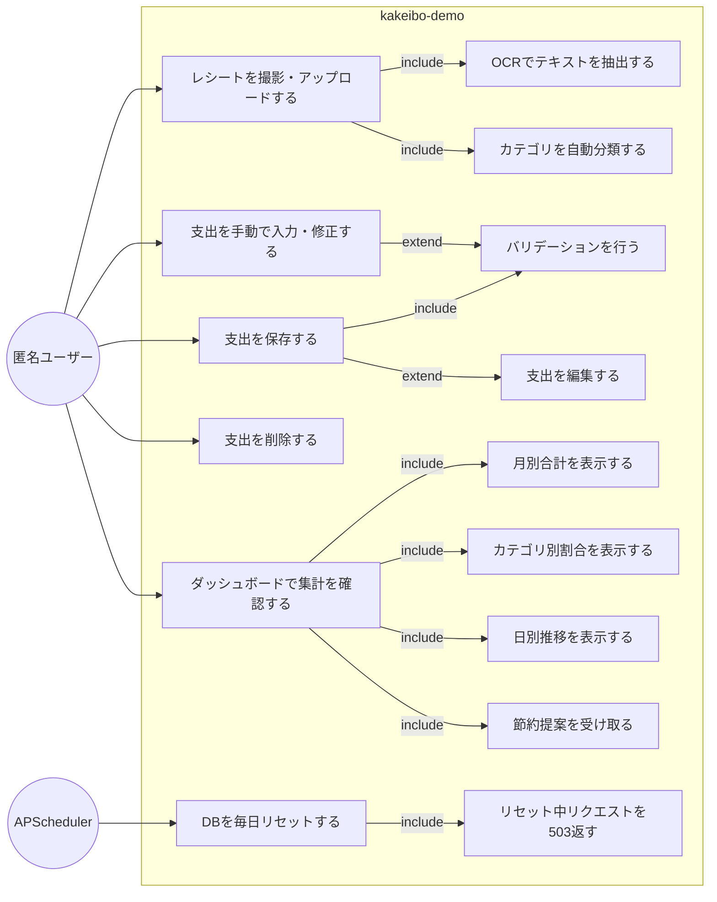

# ユースケース図 (Use Case Diagram)

最終更新: 2026-05-31

```mermaid
graph LR
    User((匿名ユーザー))
    Scheduler((APScheduler))

    subgraph kakeibo-demo
        UC1[レシートを撮影・アップロードする]
        UC2[OCRでテキストを抽出する]
        UC3[カテゴリを自動分類する]
        UC4[支出を手動で入力・修正する]
        UC5[バリデーションを行う]
        UC6[支出を保存する]
        UC7[支出を編集する]
        UC8[支出を削除する]
        UC9[ダッシュボードで集計を確認する]
        UC10[月別合計を表示する]
        UC11[カテゴリ別割合を表示する]
        UC12[日別推移を表示する]
        UC13[節約提案を受け取る]
        UC14[DBを毎日リセットする]
        UC15[リセット中リクエストを503返す]
    end

    User --> UC1
    UC1 -->|include| UC2
    UC1 -->|include| UC3
    User --> UC4
    UC4 -->|extend| UC5
    User --> UC6
    UC6 -->|include| UC5
    UC6 -->|extend| UC7
    User --> UC8
    User --> UC9
    UC9 -->|include| UC10
    UC9 -->|include| UC11
    UC9 -->|include| UC12
    UC9 -->|include| UC13
    Scheduler --> UC14
    UC14 -->|include| UC15
```
